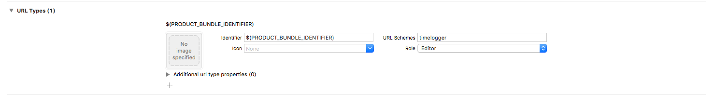

# CoreAPI-IOS-Sample
Sample code demonstrating OAuth and other features of Core API

## How to
### Setting URL Schemes
In info tab of your target

Replace timelogger by your application name

### Handle URL in AppDelegate
- On iOS implement `UIApplicationDelegate` method
```swift
func application(_ app: UIApplication, open url: URL, options: [UIApplication.OpenURLOptionsKey  : Any] = [:]) -> Bool {
    if let scheme = url.scheme, scheme == "timelogger"{
        CoreAccount.sharedInstance.handle(url: url)
    }
  return true
}
```
:warning: Any other application may try to open a URL with your url scheme. So you can check the source application, for instance for safari controller :
```
if (options[.sourceApplication] as? String == "com.apple.SafariViewService") {
```
